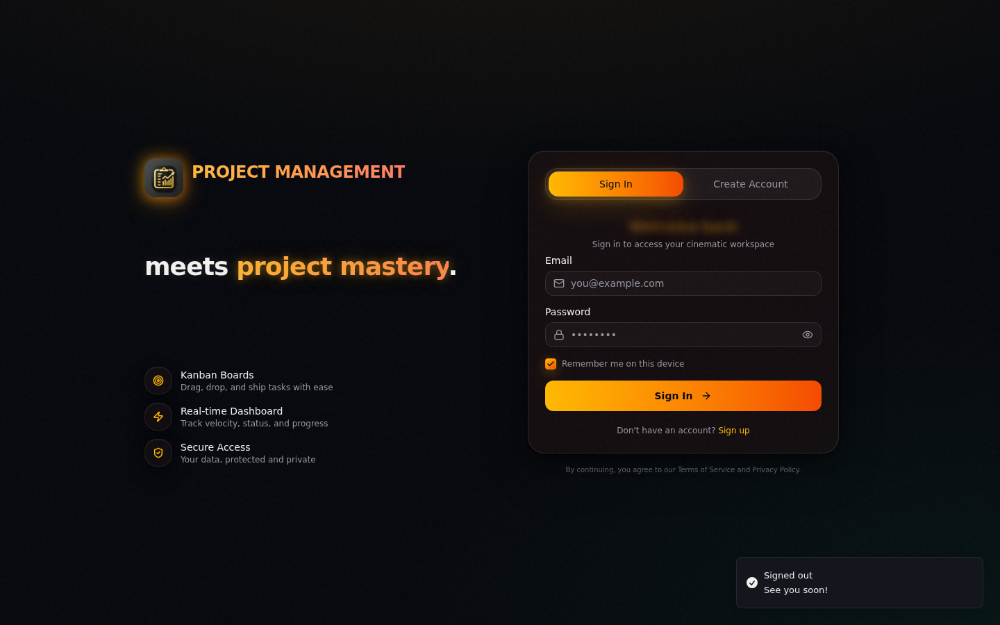
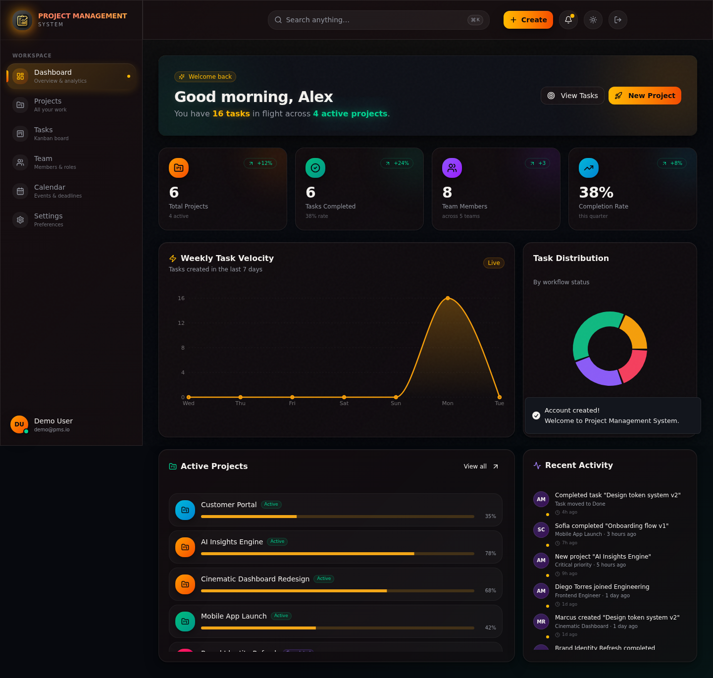
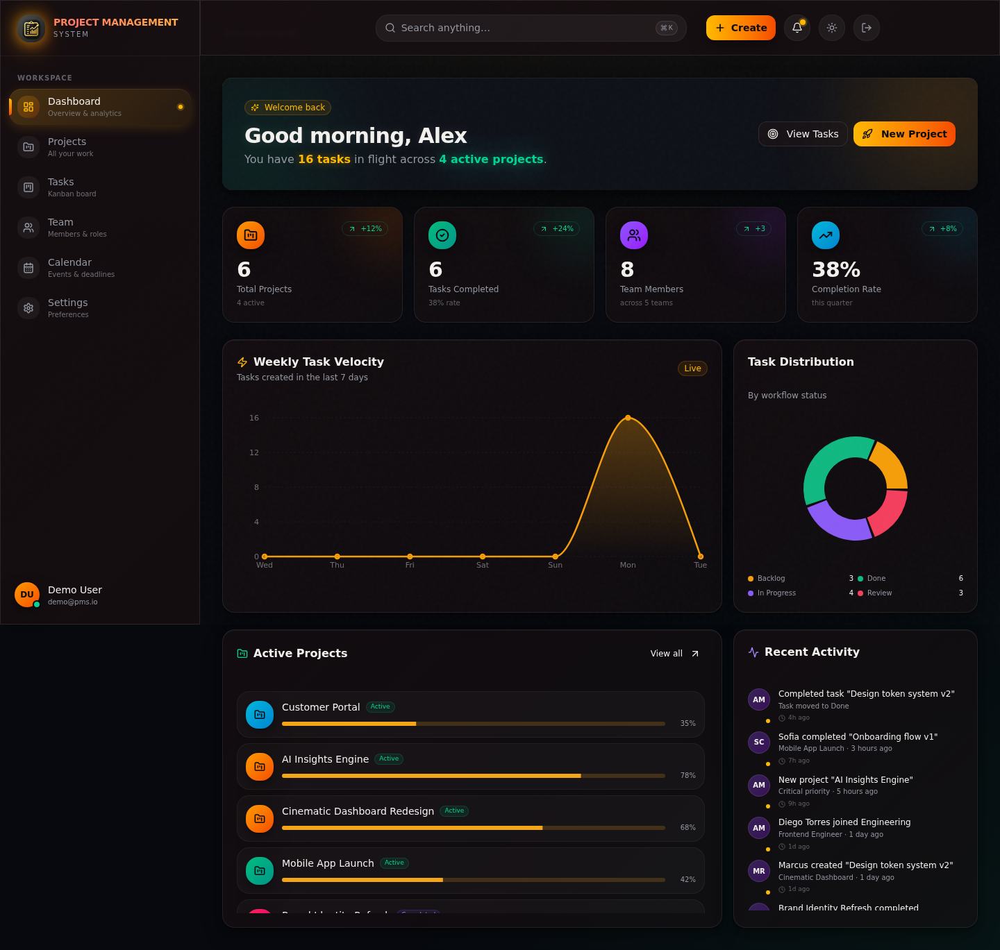
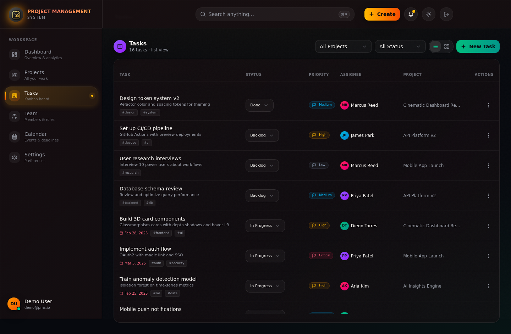
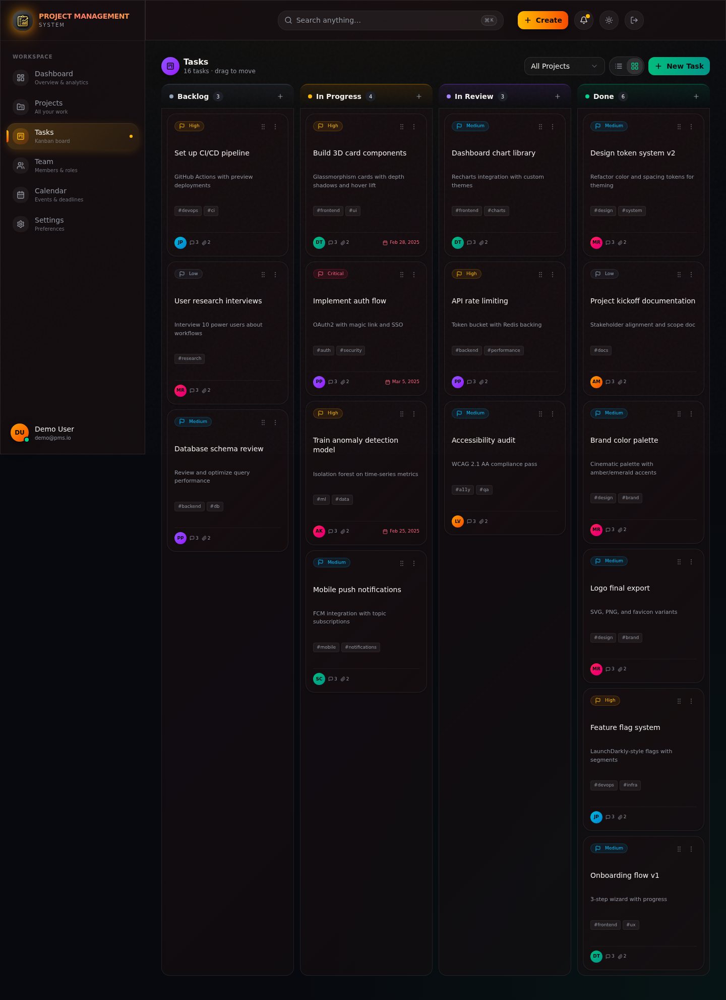
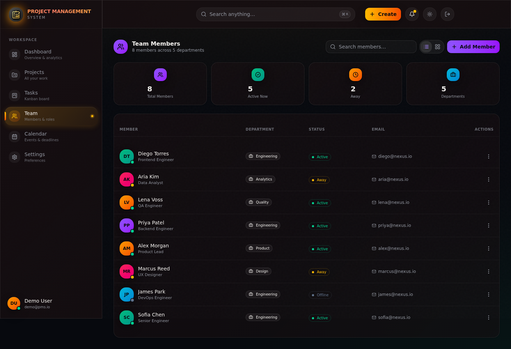
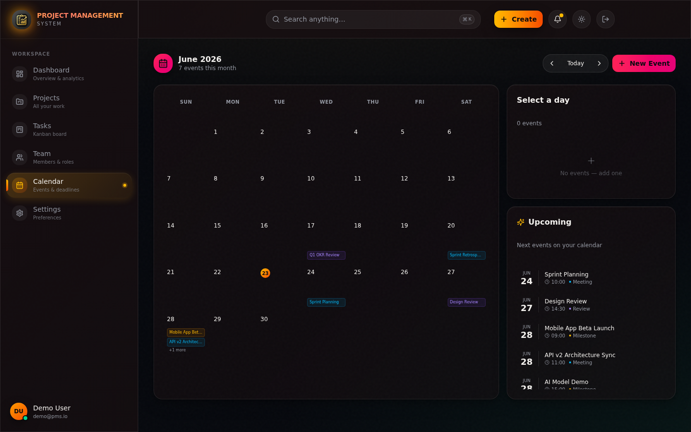
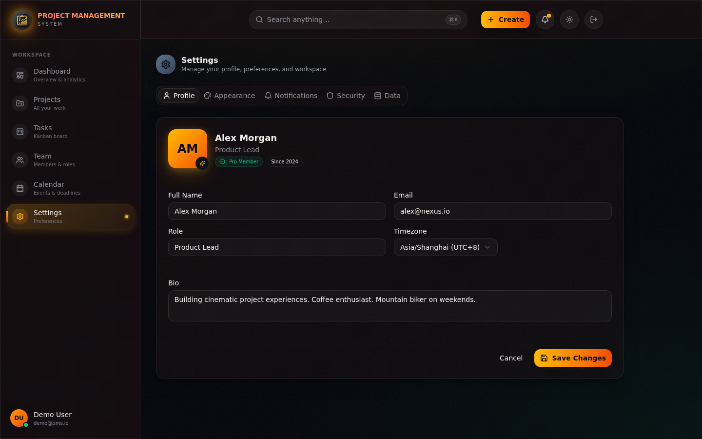
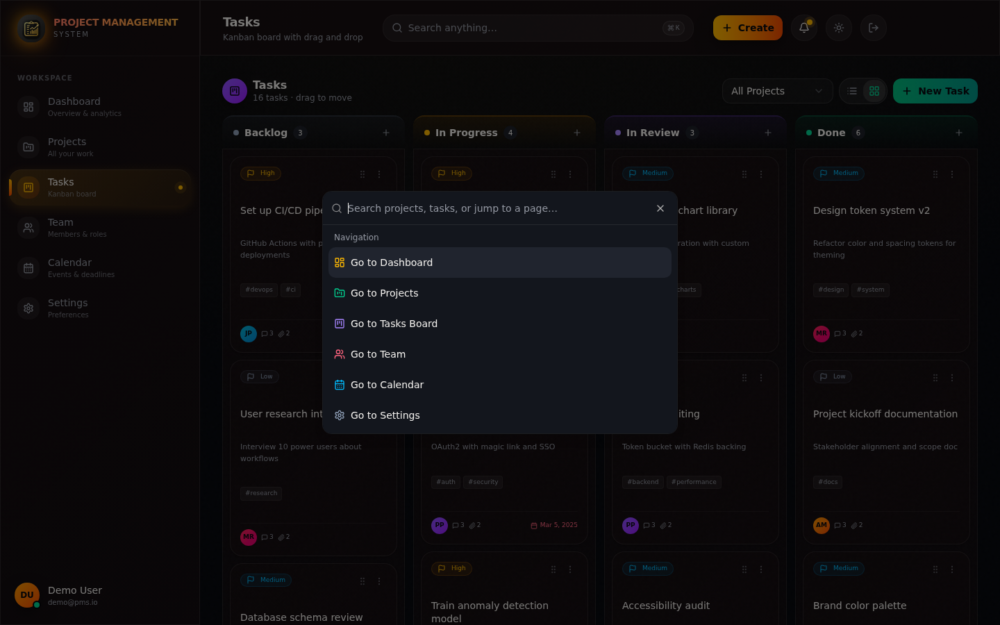
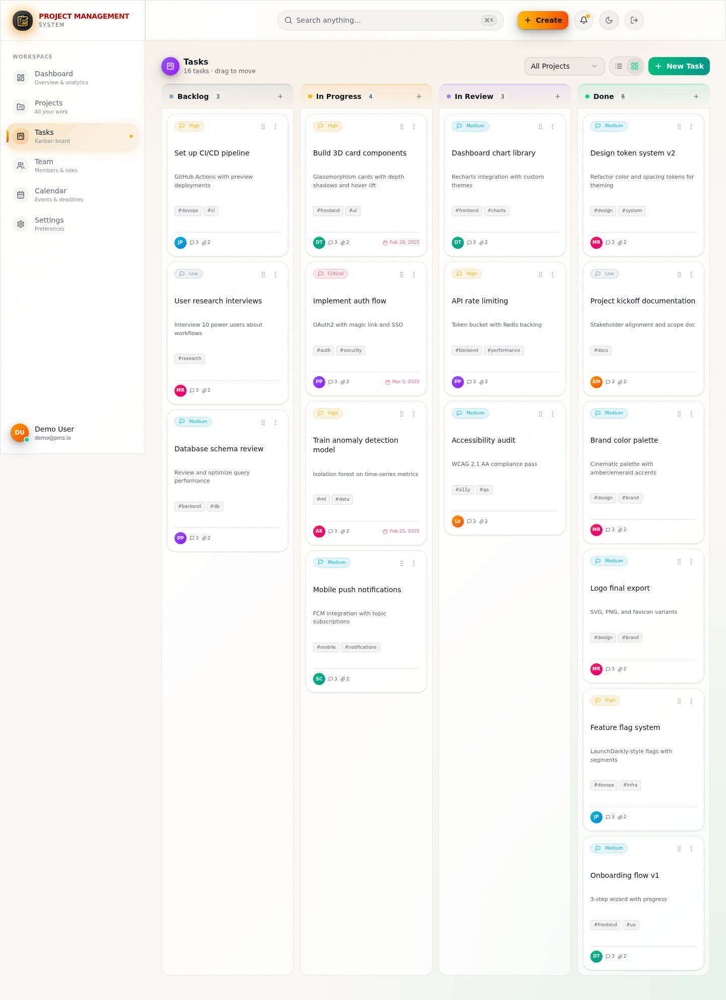

# 🎬 Project Management System

A modern, cinematic project management system with 3D-realistic UI, Kanban boards, dashboards, team collaboration, and dark/light mode. Built with Next.js 16, TypeScript, Tailwind CSS 4, and Prisma.


---

## ✨ Features

- **🔐 Authentication** — Register, login, logout with bcrypt-hashed passwords and "Remember me" persistence
- **📊 Dashboard** — Real-time stats, weekly task velocity chart, task distribution pie chart, activity feed
- **📁 Projects** — Grid & list views, create/edit/delete with modal, progress tracking, priority & status
- **📋 Tasks** — Kanban board with drag-and-drop + list view with inline status changes
- **👥 Team** — Member cards with roles, departments, status indicators
- **📅 Calendar** — Monthly view with events, milestones, deadlines
- **⚙️ Settings** — Profile, appearance, notifications, security, data management
- **🌗 Dark / Light Mode** — Toggle with localStorage persistence
- **⌨️ Command Palette** — Quick navigation with `Ctrl+K` / `Cmd+K`
- **🎬 Cinematic Animations** — 2s page transitions, letter-by-letter reveals, gradient text effects

---

## 🖼️ Sample Views

### 🔐 Login / Register Screen
Cinematic split-screen auth with letter-by-letter hero reveal and animated gradient branding.



---

### 📊 Dashboard
Overview with stat cards (clickable → navigate to related pages), weekly task velocity area chart, task distribution pie chart, active projects list, and live activity feed.



---

### 📁 Projects
List view (default) and grid view toggle. Each project card is clickable to open the edit modal. Search, status filter, and quick-create.



---

### 📋 Tasks (List View)
Default list view with sortable columns, inline status dropdowns, priority badges, assignee avatars, and project tags. Each row is clickable to edit.



---

### 📋 Tasks (Kanban Board)
Drag-and-drop Kanban board with 4 columns (Backlog → In Progress → Review → Done). Cards are clickable to open the edit modal.



---

### 👥 Team
Team member cards with gradient avatars, status dots, department badges, and contact info. Click any card to edit.



---

### 📅 Calendar
Monthly calendar with color-coded events. Click any day to see its events. Upcoming events sidebar.



---

### ⚙️ Settings
Tabbed settings: Profile, Appearance (theme + accent color), Notifications, Security, and Data management.



---

### ⌨️ Command Palette
Quick navigation and actions via `Ctrl+K` / `Cmd+K`.



---

### 🌗 Light Mode
Full dark/light theme toggle with proper contrast adaptation across all pages.



---

## 🚀 Tech Stack

| Layer | Technology |
|-------|-----------|
| **Framework** | Next.js 16 (App Router) |
| **Language** | TypeScript 5 |
| **Styling** | Tailwind CSS 4 + shadcn/ui |
| **Database** | Prisma ORM (SQLite) |
| **Auth** | Custom JWT cookie + bcrypt + localStorage |
| **State** | Zustand (client), React Context (auth/theme) |
| **Animations** | Framer Motion + CSS keyframes |
| **Charts** | Recharts |
| **Drag & Drop** | @dnd-kit |
| **Icons** | Lucide React |

---

## 📦 Getting Started

```bash
# Install dependencies
bun install

# Set up the database
bun run db:push

# Start the dev server
bun run dev
```

The app runs on `http://localhost:3000`. On first launch, it auto-seeds demo data (6 projects, 16 tasks, 8 team members, 7 events).

---

## 🗄️ Database Schema

```
User        → email, password (bcrypt), name, avatar
Project     → name, description, status, priority, progress, color, dueDate
Task        → title, description, status, priority, assignee, tags, dueDate
TeamMember  → name, role, email, department, avatar, status
Activity    → type, title, description, userName, projectId
Event       → title, description, date, time, type, projectId
```

---

## 🎨 Design System

- **Color Palette**: Amber/gold (primary), emerald (success), rose (danger), violet, cyan accents
- **Glassmorphism**: Backdrop-blur panels with subtle borders
- **3D Depth**: Layered shadows, hover-lift animations, glow effects
- **Typography**: Geist Sans with cinematic letter-spacing reveals
- **Film Grain**: Subtle noise texture overlay for cinematic feel

---

## 📂 Project Structure

```
src/
├── app/
│   ├── api/              # API routes (auth, projects, tasks, team, events, dashboard)
│   ├── layout.tsx        # Root layout with providers
│   ├── page.tsx          # Main app entry
│   └── globals.css       # Cinematic design system
├── components/
│   ├── pm/               # Project management components
│   │   ├── pages/        # Dashboard, Projects, Tasks, Team, Calendar, Settings
│   │   ├── modals/       # Create/edit modals
│   │   ├── app-shell.tsx # Main layout with auth gating
│   │   ├── sidebar.tsx   # Navigation sidebar
│   │   ├── topbar.tsx    # Top bar with search, create, theme toggle
│   │   └── auth-screen.tsx
│   └── ui/               # shadcn/ui components
├── lib/
│   ├── auth-server.ts    # JWT + bcrypt auth logic
│   ├── db.ts             # Prisma client
│   ├── store/            # Zustand stores
│   └── types.ts          # Shared TypeScript types
└── prisma/
    └── schema.prisma     # Database schema
```

---

## 📄 License

MIT © Project Management System
